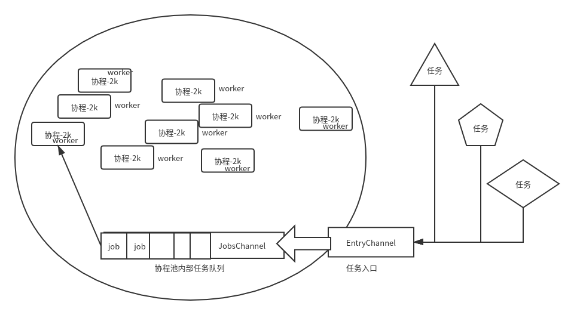

为什什么需要协程池?  
虽然go语言言在调度Goroutine已经优化的非常完美,并且Goroutine作为轻量量级执行流程,也不需要
CPU调度器的切换,我们一般在使用的时候,如果想处理一个分支流程,直接 `go` 一下即可。但是,如果无无休止止的开辟Goroutine依然会出现高高频率的调度Groutine,那么依然会浪费很多上下文文
切换的资源,导致做无用功。所以设计一个Goroutine池限制Goroutine的开辟个数在大型并发场景还
是必要的。

goroutine池简易设计思路  




快速实现并发goroutine池  

````
````